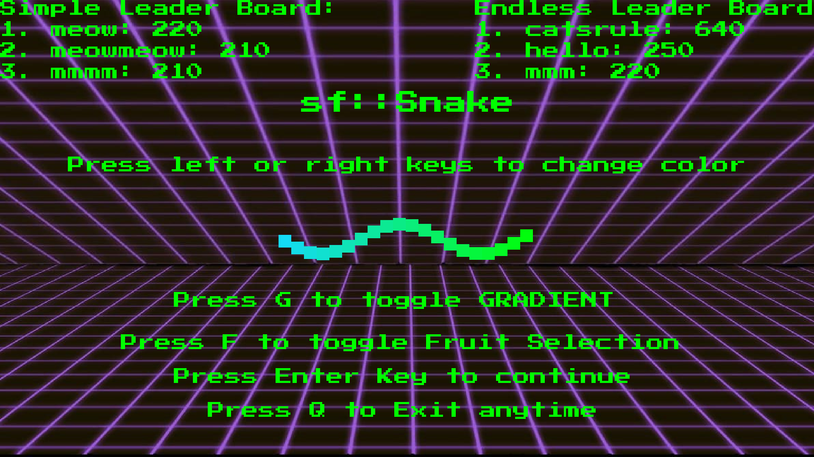
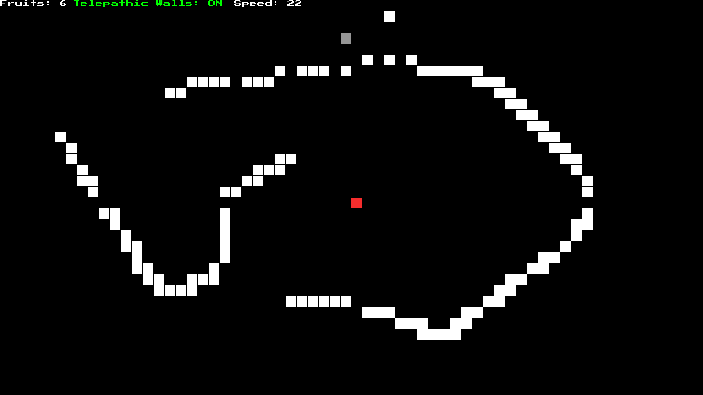
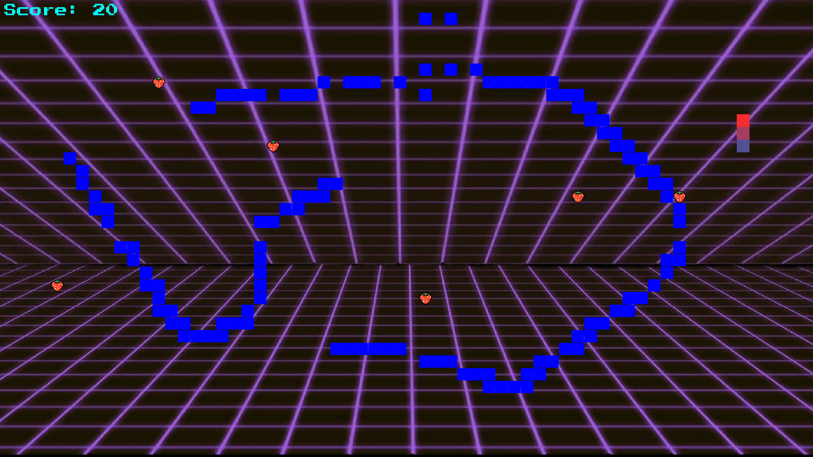

# Snake game in sfml

It's a snake game I made with my bro as final project for programming fundamentals in first semeseter.

To play the game simply choose a game mode (simple, endless and custom)

<h1>Simple</h1>

Simple game mode consists of levels with obstacles increasing with each other making the game more fun to play

<h1>Endless</h1>

Endless game mode has telepathic walls that let u move from one wall end to the other making the game more relaxing to play. Also there is a powerup as well, that resets the snake length back to 1.

<h1>Custom</h1>

Allows you to unleash your creativity by giving you the ability to design levels, adjust snake speed, toggling telepathic walls and increasing food amount.

 

<h1>How to Play</h1>

Simple, just use the arrows or WASD keys to move the snake, press ESCAPE key to pause the game at any moment.
